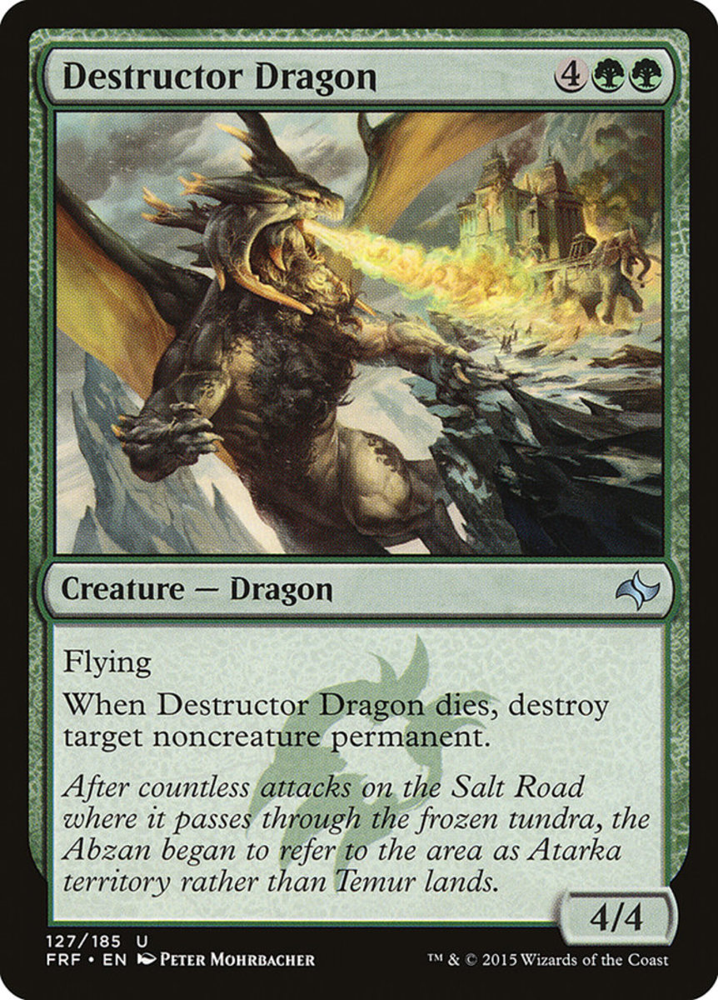
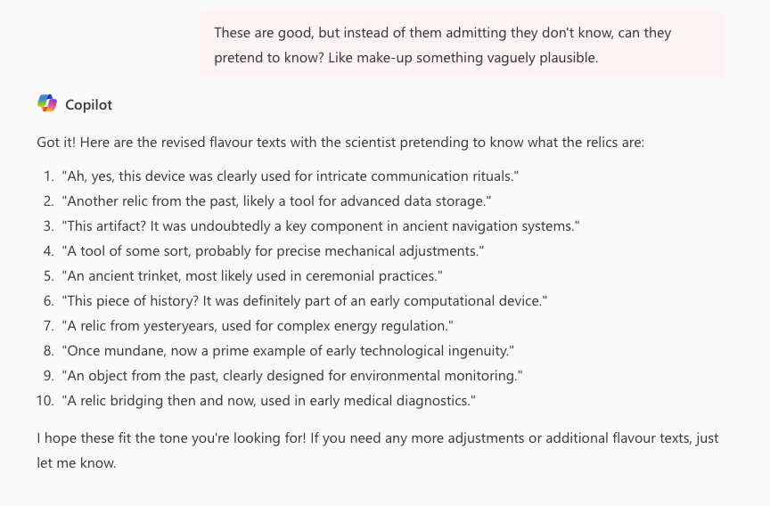

# Week 10 - Narrative Design
In today's lab, we will be looking at methods for inserting narrative/fiction elements into our tabletop games.

## Tools used
Today's task uses (but is not limited to):

* GitHub Desktop (or your GitHub client of choice)
* Microsoft Co-Pilot (If you want)
* Photoshop (if you want)
* draw.io
* playingcards.io

## Assignment deliverable
Today, you will be learning techniques for inserting narrative elements into your tabletop game. Depending on where you are at with your group, this may be your actual final project, like what you will be doing in class. Alternatively, if you are not yet in a group, you can complete these tasks using a "made-up" game and setting. In doing so, you might come across some good ideas to apply to your final game!

## What to do if you don't have a group or design
If you don't have a group yet, or your group hasn't come up with much of a design yet, it's a bit hard to layer any narrative onto it! If you are in this situation, pick one of the existing games on playingcards.io and use this as the basis for your narrative. You may wish to come up with a setting based on the game or use one you already have in mind.

## Task 1 - Card and Token Design
Tabletop games give a few different possibilities for where we can insert elements of narrative into our game. One we are going to look at today is in general card and token design. 

### Tokens
While we can use the standard, boring token designs in playingcards.io, we can also upload our owns and make this fit the theme of our game. To change the images of a token, first press "Edit Room", then scroll down to the "Pieces" section.

Then, select "Custom Pieces Collection" to start from scratch. This will create a Pieces Collection on your game board. When you select it, you'll be able to edit the collection on the right side of the screen. Click "Template" to open the editor for all pieces in this collection.

From here, you can add images and text to the piece. Think about what these tokens should look like in your game. Consider:

* What is the behaviour of the resources you are collecting? What does this mirror in real life?
* How might these resources look to a person in the role the player is inhabiting? Should they be detailed, or more abstract? What are their important features?
* If your game already has resources in mind, how might you represent these?

You can import images that you have the rights to here, or alternatively create some simple mock-ups by hand or using a tool like [draw.io](https://app.diagrams.net/). Try your hand at importing one image, and then feel free to simply mock-up some others.

You can also add text to an image, by pressing the "TEXT" button. Generally, we simply want to use this to communicate quantity of a resource, but in the case of more unique resources, what might you want to say?

### Cards
We can do the same for cards. Typically, cards have a lot more info on them in tabletop games, and really this is where you can do a lot of your narrative work. Let's look at a card from Wizards of The Coast's _Magic: The Gathering_:

There are multiple places on this card where both narrative and game elements are communicated, including:

* The name of the card (invoking the fantasy and telling a bit about what the card might do)
* The resources required for the card (solidifying the card's status, communicating its mechanical requirements, and also situating it in the broader lore of the game)
* The image (Communicating setting, what the beast looks like, and overall feeling of the card).
* The creature type (A mechanical element that reinforces the fantasy setting)
* The text about what the card does (predominantly mechanical but attached to the fiction - nothing is actually "flying", for instance, but this is part of the lore).
* The italicised flavour text (Completely non-mechanical but helps contribute to the game's fiction. We'll talk more about this later).

We can achieve all of this and more in playingcards.io! 

Once again, create a custom collection, this time a card deck. Head to the "Card Decks" menu and select "Custom Card Deck".

Unlike with the token, you'll be given a complete standard playing card deck here. It is up to you, but I'd advise deleting all but one card to start with, by clicking on "Cards" then pressing the trash can icon on the far right of each card. This will save you from editing them all, and instead allow you to create from scratch.

Once again, you can insert images and text info here. However, you could also create these as files in draw.io, Photoshop or another tool. We'll get more into card design next week, so for now think about:

* What do the cards in your game represent? Do they represent resources, people, concepts? Maybe they represent multiple things.
* How might what they represent be best shown on a card? What is important information for both the mechanics of the game and the narrative?

Spend some time blocking out what a card might look like either on pen and paper, or in draw.io or a similar app. Think a little bit about what information would go were on a card. Try drafting a few. If you need images, consider the [Public Domain Image Archive](https://pdimagearchive.org) as mentioned in previous weeks. Think about what the images on your card say about your character or concepts. These can be placeholder for now but have a look through and try uploading some to your game. For today, just try building the card elements inside playingcards.io rather than photoshop or another app. This will give you a better grip on the affordances and limitations, so you know what to expect later.

## Task 2 - Layout and Naming
There are a lot of very mechanical names for the elements of a tabletop game: draw piles, discard piles, etc. Rarely do these tell us anything about the world we are inhabiting when we play these games. Consider what the different piles, etc. of your game are. Some common ones in games (including the obvious) are:

* Discard piles - where cards go once they have been used. Sometimes players have individual ones, sometimes it is shared.
* Draw piles - where players get new cards from. Sometimes there are many of these for different card types, sometimes these are shared or individual.
* Hands - the cards in the player's hand. There isn't much more to say on this.
* Cards in play - the cards that are actively in play. These vary wildly depending on the game and rules, but often this is different from a player's hand.

Note down all of these for your game and their place on the game board, if this is defined. Think of how these names can be changed to still communicate what they do, but be more evocative of the game's fiction. For instance, "discard" piles often get renamed to "graveyard" piles in some games. While this is more exciting than "discard", it doesn't really work for a game about managing sushi orders, for instance ("trash can" or "washing-up" might work better in that case). Try to strike the right balance.

Record this information in your notebook or a document that you can easily access. If your team has already started working on the final assignment, there might be a shared document you can add to (or now is the time to make one!)

We will be returning to the layout of the board next week.

## Task 3 - Flavour Text
A very powerful way to directly communicate narrative and story to your player is via flavour text: short pieces of text on the card that don't impact the gameplay, but simply tell the player something about the world. Flavour text is tricky to get right, as it is often lacking in context and needs to be short enough to not be distracting while still being exciting for the player. Some common forms of flavour text include:

* Item descriptions that suggest at their power, but leave something a bit mysterious.
* A quote from an in-universe text, such as a grimoire or field report.
* A quote from a character in the game's universe. This can be a useful way of giving more life to your world by suggesting certain inhabitants.
* A short piece of the item's history. This is a bit more clinical, but can be effective at getting a message across.

Consider the place of flavour text in your game, and try writing a few for the cards you have created. As a constraint, limit yourself to having your flavour text being only one sentence, and fitting on three lines on your card. Remember that these should add to the game's fiction and worldbuilding, but not be distracting to your player or interfere with them understanding the rules.

### Task 4 - Sharing your game
Find another student in the class and chat about your work. Show them the mechanics of your game, and the narrative design decisions you have made. How do you think you'll tell the player the story the most in your game? What did you find challenging? Where are you stuck? Listen to their feedback, and provide your own to them on their design.

## Optional Task: Using Co-Pilot
### Disclaimer
Some of you are likely already avid Generative AI users. Others may not have touched it, and some might have very strong feelings against using it. We respect that position completely, but are presenting this optional task for those who want to try out using it. Please remember that if you do use Generative AI when creating your assignment, you must credit, source and acknowledge it, and you can only receive marks for your own work. This section below will provide you with an approach to Generative AI that we deem acceptable in this unit (provided you appropriately evidence its use!). 

As a final note before we get into it, remember that some studios find Generative AI unethical or otherwise unattractive. Using Generative AI in your portfolio will attract some people to your work, and turn others away. In this context of design, we are not here to discuss the ethics of using Generative AI (but feel free to reach out to us about it!). This is something you as a designer need to decide for yourself.

### Logging-in to Co-Pilot
A stumbling point of using Generative AI is feeding your data to companies that will then use it to train their models. Obviously, this is a big concern for us at Macquarie University, as we do not want students to lose their IP to training models, nor do we want to part with our own (such as assessment descriptions and rubrics). As such, we have partnered with Microsoft for a closed version of Co-Pilot that you are able to use in this case. To access it, head to https://copilot.microsoft.com/ and log-in with your **student email address**. You will then be prompted as to whether you want the "Work" experience or the "Personal" experience. Select "Work" to be taken to the closed system, where Copilot will not train on your data.

### Prompting for Flavour Text
An adage is that whatever you are good at, you are probably better at than AI. As such, and given what we are marking you on in this unit, we don't recommend you use Copilot for any of your design work, and this indeed might impact your mark. However, farming out tasks that are either very time-consuming or don't engage with what we are teaching in this unit is something we can get behind in some instances. Writing large passages of similar text such as Barks or Flavour Text are the kinds of things that some Narrative Designers are looking at giving over to Generative AI, as the work of "writing" isn't necessarily the design work itself.

As such, you may want to experiment with getting Copilot to create some flavour text examples for you to give you a head start working on your cards.

Firstly, formulate a good prompt. You want your prompt to Copilot to:

* Explain the task you are approaching. Let it know you are making a tabletop game, and need flavour text!
* Explain the narrative setting of your game. You want to use as many relevant genre terms as possible to help situate the tool as to what you are after.
* Describe what the cards you need flavour text for are. You probably don't want to use this for anything too specific, such as unique cards -- consider the larger resources in your game where the exact details are less important.
* Ask for a specific number and format. You want to ensure these are consistent.

See below for what I sent to Copilot and received back:

Hmm...some good responses there, although the relic cards a bit too generic, and have a few statements in there that don't really fit the style of my game, like "This ancient artifact hums with forgotten energy". In fact, I think I've seen that in another game! As a narrative designer, I now can think about how to make these stronger. I could stop using Generative AI at this stage, or I could try to get some of these re-written. Now I want to think about the more specific details of my narrative design. How do I want this flavour text to sound? Perhaps it could come from a particular character, or be written as if from an in-game text like a grimoire or field report. Apply this to your own game and consider what makes the most sense in your world (no, don't ask Generative AI for this! This is where you are doing design thinking!). Here's my next shot:

Now this is starting to capture the characters of my world, but it's all a bit too generic now. A final go:

These are...better. But there's still work to be done. They are quite generic, and it seems like Copilot is losing one part (arrogance) to get to another (pretending to know). The whole thing is a bit mundane. At this point, I would take these and fine-tune them by hand. They've given me a starting point, and now I can continue my work as a narrative designer to make sure these capture what I want.

### Other uses
There are likely other use cases for Generative AI in your Narrative Design. However, it is important to remember that this is still indeed part of your game design, and so as a game designer, you really shouldn't be offloading too much to Generative AI. We'd encourage you to make sure you keep your own human-hand on everything you submit, and so using Generative AI for anything more than generating a bunch of starting phrases is probably too far. We encourage you to have a chat with us (the course convenor and lecturers) about this if you'd like.

## Capturing your work
Make sure that you back-up whatever you've created today by saving and exporting your room. If you've been working on your final game, or you've discovered some ideas that you'd like to use in it, make sure you are saving this for communicating with your group.

## Next Week
Next week we will be looking at UI and UX design for of tabletop games, and again working either on our final game directly, or coming up with tools to help us with doing so. Either way, ***you must be in a group by next week!!***
